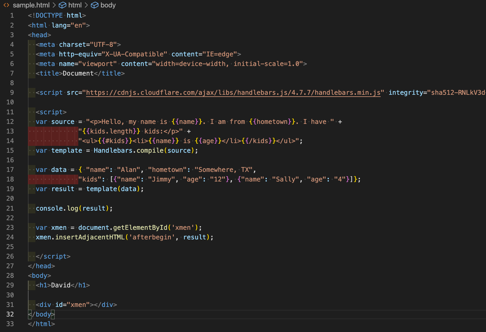

# Test Miniracer

> Test Miniracer provides a test harness for exploring the miniracer gem

## Sean ToDo

- Create HTML File
- emmet, html:5, install the extension using VSCode shift+command+x
- Emet a new HTML File
- Run a liveserver (VSCode extension)
- Add a script to handlebars JS (find on cdn)
- Add some script, see screen shot, but I found this on github
- [Handlebars JS](https://github.com/helpers/handlebars-helpers)
- Add div using emmet
  - div#xmen
  - var d1 = document.getElementById('one');



## Installation

Add this line to your application's Gemfile:

```ruby
gem 'test-miniracer'
```

And then execute:

```bash
bundle install
```

Or install it yourself as:

```bash
gem install test-miniracer
```

## Stories

### Main Story

As a Developer, I need to workout how the miniracer gem works, so I can implement javascript engine in ruby

See all [stories](./STORIES.md)

## Usage

See all [usage examples](./USAGE.md)

### Basic Example

#### Basic example

Description for a basic example to be featured in the main README.MD file

```ruby
class SomeRubyBySean; end
```

## Development

Checkout the repo

```bash
git clone klueless-io/test-miniracer
```

After checking out the repo, run `bin/setup` to install dependencies. Then, run `rake spec` to run the tests.

You can also run `bin/console` for an interactive prompt that will allow you to experiment.

```bash
bin/console

Aaa::Bbb::Program.execute()
# => ""
```

`test-miniracer` is setup with Guard, run `guard`, this will watch development file changes and run tests automatically, if successful, it will then run rubocop for style quality.

To release a new version, update the version number in `version.rb`, build the gem and push the `.gem` file to [rubygems.org](https://rubygems.org).

```bash
rake publish
rake clean
```

## Contributing

Bug reports and pull requests are welcome on GitHub at https://github.com/klueless-io/test-miniracer. This project is intended to be a safe, welcoming space for collaboration, and contributors are expected to adhere to the [Contributor Covenant](http://contributor-covenant.org) code of conduct.

## License

The gem is available as open source under the terms of the [MIT License](https://opensource.org/licenses/MIT).

## Code of Conduct

Everyone interacting in the Test Miniracer project’s codebases, issue trackers, chat rooms and mailing lists is expected to follow the [code of conduct](https://github.com/klueless-io/test-miniracer/blob/master/CODE_OF_CONDUCT.md).

## Copyright

Copyright (c) David Cruwys. See [MIT License](LICENSE.txt) for further details.
